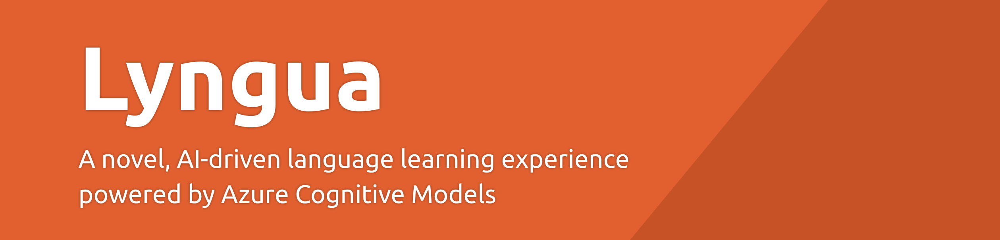

&nbsp;
&nbsp;

# Lyngua

Lyngua is a novel, AI-driven language learning experience powered by [Microsoft Azure Cognitive Models](https://azure.microsoft.com/en-au/services/cognitive-services/). This repository represents our submission for the [Microsoft Azure AI Hackathon](https://azureai.devpost.com/).

This project is live at https://lyngua.silentbyte.com/.

## Inspiration
TODO

## What it does
TODO

## How we built it
TODO

## Challenges we ran into
TODO

## Accomplishments that we're proud of
TODO

## What we learned
TODO

## What's next for Robin
TODO

---

## Build Instructions

TODO

## License

MIT, see [LICENSE.txt](LICENSE.txt).
