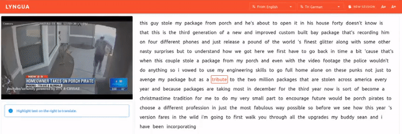
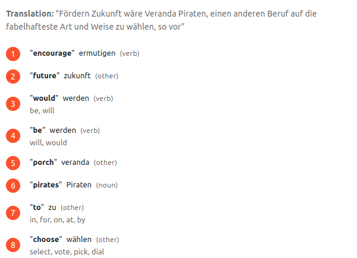
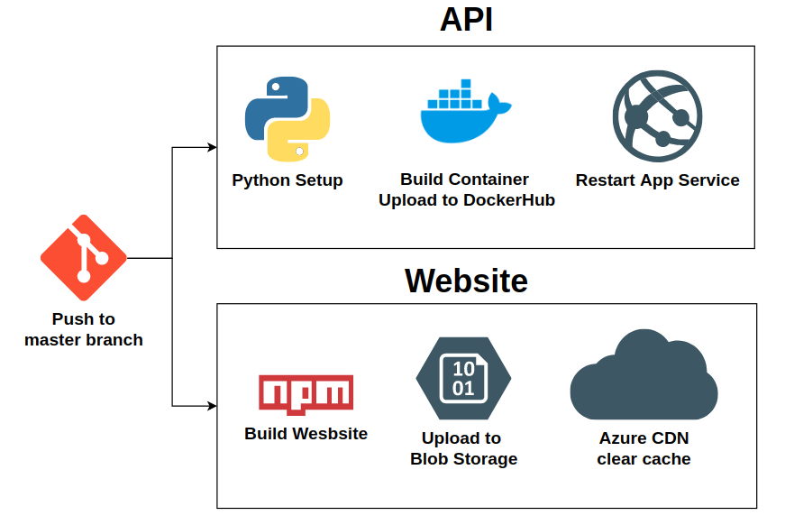

[](https://lyngua.silentbyte.com) 
[](https://lyngua.silentbyte.com) 
[](https://lyngua.silentbyte.com)
[](https://img.shields.io/docker/pulls/stephenmo/lyngua)

# Lyngua

Lyngua is a novel, AI-driven language learning experience powered by [Microsoft Azure Cognitive Services](https://azure.microsoft.com/en-au/services/cognitive-services/). This repository represents our submission for the [Microsoft Azure AI Hackathon](https://azureai.devpost.com/).

This project is live at [https://lyngua.silentbyte.com/](https://lyngua.silentbyte.com/).

## What it does

Lyngua is a more interactive way for integrated language learning through interesting materials provided by your favorite YouTube content creators. It leverages the power of Microsoft Azure Cognitive Services which include speech-to-text for video transcription, pronunciation scoring, and translation.

Lyngua allows you to select videos created by a native speaker in the language of your choice, which will then be transcribed for you. You can then read along with the text as it plays to hear the pronunciation, then use the microphone functionality to record your own pronunciation and subsequently receive a score, giving you an indication of which words to practice.
To assist you in your learning, Lyngua will handily provide you with a set of translations and possible back-translations (similar words that the translation could be).

This process is a lot more entertaining and directed as you’re the one who chooses the content.


**A Pug before and after using Lyngua to learn a new language**

Features include:

***Examples are shown from the point of view of someone who knows German learning English***

* Words are highlighted as they are being said in the video (Using Azure speech-to-text transcriptions).



* Pronunciation scoring to see which words the user is having trouble pronouncing correctly.


* Translation and alternate back-translation for context.



Lyngua currently supports the following languages due to the limitations of what's supported by Azure for the 
functionality we need:

* English
* German
* French
* Italian
* Portuguese


## Goals

We had a few goals with this project:

### Make something low cost

Keep costs low, and where possible, utilize free tiers or low cost services over the most performant ones. Looking at our spending, we did pretty well on this front:

 


### Build something fun and useful

We wanted to build something that sounded like fun, and that we could use. Considering all three of us are trying to
learn at least one language, doing something around learning languages seemed worthwhile.

## How we built it

### Azure Components used

* [Azure Blob Storage](https://docs.microsoft.com/en-us/azure/storage/blobs/storage-blobs-introduction)
* [Azure Blob Storage Static Website](https://docs.microsoft.com/en-us/azure/storage/blobs/storage-blob-static-website)
* [Azure CDN](https://docs.microsoft.com/en-us/azure/cdn/cdn-overview)
* [Azure Web App Service](https://docs.microsoft.com/en-us/azure/app-service/overview)
* [Azure Cognitive Services Translator](https://docs.microsoft.com/en-us/azure/cognitive-services/translator/)
* [Azure Cognitive Services Speech](https://docs.microsoft.com/en-us/azure/cognitive-services/speech-service/)


### Architecture

Lyngua is split into two separate components. The website is written in TypeScript with Vue as the front-end framework and the back-end API which is a python docker container powered by FastAPI.


### Website

Website hosting is done through [Static Website Hosting in Azure Storage](https://docs.microsoft.com/en-us/azure/storage/blobs/storage-blob-static-website) which is a very cost-effective, low-effort, and reliable way of hosting a static website. Updates are as simple as running the ``az storage blob upload-batch`` command.

The TypeScript/Vue/Vuetify source code is available in the ```app``` folder.


### API


The back-end API is hosted as an [Azure App Service WebApp](https://docs.microsoft.com/en-us/azure/app-service/overview).
This API is deployed as a [custom docker container](https://docs.microsoft.com/en-us/azure/app-service/quickstart-custom-container?pivots=container-linux) called [lyngua](https://hub.docker.com/r/stephenmo/lyngua)
which is written in Python 3.8 and powered by the [FastAPI](https://fastapi.tiangolo.com/) framework with [Uvicorn](https://www.uvicorn.org/) as as the server (synchronous Server Gateway Interface).

This back-end API is responsible for exposing three public endpoints which coordinate multiple azure resource calls.

### GetVideo


The GetVideo endpoint is responsible for generated the Speech to Text (STT) transcription using the [Azure Cognitive Services Speech API](https://docs.microsoft.com/en-us/azure/cognitive-services/speech-service/rest-speech-to-text).

* It will first check [Blob Storage](https://docs.microsoft.com/en-us/azure/storage/blobs/storage-blobs-introduction) to see if a previous STT exists, if it does then it'll pull the cached version.
* If the cached results do not exist then [FFmpeg](https://www.ffmpeg.org/) is used to pull the audio from youtube
* This audio is then fed into the [Azure Cognitive Services Speech API](https://docs.microsoft.com/en-us/azure/cognitive-services/speech-service/rest-speech-to-text).
to generate a STT transcription.
* The STT transcription is then saved to [Blob Storage](https://docs.microsoft.com/en-us/azure/storage/blobs/storage-blobs-introduction) keyed with the video id and source language.

Caching was done for two main reasons:

1. The process of downloading a video and then transcribing it takes some time (generally under 30 seconds), so caching 
any previous results makes Lyngua significantly more responsive.
2. The Speech to Text API is billed per minute of audio, so it's significantly cheaper to cache any common results that 
multiple users may be requesting.


### Pronounce 


The pronunciation endpoint takes in audio recorded from the user's microphone along with the ground truth set of words 
established by the users selection and sends them to [Azure Cognitive Services Speech API in detailed mode](https://docs.microsoft.com/en-us/azure/cognitive-services/speech-service/rest-speech-to-text#pronunciation-assessment-parameters).
Lyngua will then show a list of words that the user has not pronounced correctly, and the confidence of that prediction.

**For privacy reasons, Lyngua does not store the audio of user recordings.**


### Translate


The translate endpoint uses two different services under the [Azure Cognitive Services Translate API](https://docs.microsoft.com/en-us/azure/cognitive-services/translator/)
banner.
* [Dictionary](https://docs.microsoft.com/en-us/azure/cognitive-services/translator/reference/v3-0-dictionary-lookup) 
which used to establish the type of word (Adjective, Noun, Verb etc) and any additional back-translations the word has to
get more context around the translation.
* [Translate](https://docs.microsoft.com/en-us/azure/cognitive-services/translator/reference/v3-0-translate) to generate
the actual translations that are displayed to the user.


## Challenges we ran into

### Inability to use Function App

We originally wanted to go with Azure Function apps because scaling works a lot better, and with Microsofts VS Code 
extensions is an extremly pleasant platform to develop on. Unfortunately our dependency on FFmpeg would mean that we'd 
have to resort to [custom containers](https://docs.microsoft.com/en-us/azure/azure-functions/functions-create-function-linux-custom-image?tabs=bash%2Cportal&pivots=programming-language-csharp)
which would require us to update to a premium/dedicated plan which went against our initial goal of trying to make this
as approachable (cheap) as possible for developers.

This is why we ended up writing our back-end as a FastAPI powered [Docker container hosted with App Service](https://docs.microsoft.com/en-us/learn/modules/deploy-run-container-app-service/).


### Azure App Service Cold Starts

Azure App Service does a really cool thing if you're the one paying the bills -> [It switches your app service off when 
not in use](https://azure.microsoft.com/en-au/blog/understanding-serverless-cold-start/) under the consumption plan
and only bills you for the time that it was on.

The catch with that is because our container is so large (FFMPEG has a lot of dependencies), it takes a while to pull,
so going from being turned off (cold start) can take a while before it will return responses. To improve this time we 
implemented two workarounds:

* We reduced the size of the container by using the ``slim`` variant of Ubuntu.
* We added an endpoint to wakeup the API container whenever the website is loaded.

There was an additional workaround that could have sped things up (moving the container to [Azure Container Registry](https://azure.microsoft.com/en-au/pricing/details/container-registry/) hosted in the same region as our app service to take advantage of the faster Azure networking) but we ended up not taking this approach to reduce complexity in setting the application up for anyone wanting to run this themselves.

### Continuous Integration/Continuous Deployment

From a [previous hackathon](https://devpost.com/software/maskcam) we learnt that it would probably be important to set 
up continuous integration/deployment to try to catch integration errors quickly.

Part of the testing process spins up the API as a Docker container and runs some test calls to check that the endpoints
work correctly. Due to the way that Github action handles environment variables with escape characters we had some 
trouble getting these tests to work under Github actions as the Azure Storage Keys were being passed incorrectly.
Ultimately, because we left things to the last minute, we ended up avoiding running pytest and instead just tested
whether the container would build and whether the lyngua package would install.

The automating deployments was easy enough with the [Azure CLI](https://github.com/marketplace/actions/azure-cli-action) 
and [Build and push Docker images](https://github.com/marketplace/actions/build-and-push-docker-images) Github Actions.
These actions can be found in ```.github/workflows/main.yml```

### Microphone

Accessing the microphone from the browser requires the use of specific APIs that are still evolving and may vary between
different browsers, so getting microphone recording to work properly was a bit difficult to get working.

Voice data comes in as raw samples that have to be processed first. By looking at the amplitude 
over time we can calculate the peak and use this information to visualize the input to give the user an indication that
the microphone is recording. The sampled amplitudes are also copied over into a custom buffer that is then manually 
encoded as a WAV file before being sent to the back-end.


## Accomplishments that we're proud of

### Setting up Continuous Deployment

This hackathon will mark the first time that we set up Continous Deployment in an effort to stop the usual 
"can you push the changes to prod" blocker that we've encountered in the past. This will also be the first time that we 
have tried setting up Github Actions as a CICD runner as we've previously only used Jentinks, Teamcity and TravisCI.



Our Github actions automate the deployment of the website and back-end API.

## What we learned

### Github Actions

This was a good chance for us to learn how to use Github actions instead of less open CICD runners.


### Learn more about Azure

We've had some exposure to Azure but not a huge amount, so we wanted to learn more about how it worked and how we could
incorporate it into our personal projects.

As a result of the things Stephen learnt on this project he ended up completing his [Azure Certified Developer Associate Certificate](https://www.credly.com/badges/a50a6ac7-486d-40a4-84a7-b8c9e783ec5c?source=linked_in_profile).


## Build Instructions

### Installing build tools

* [Install NPM](https://www.npmjs.com/get-npm)
* [Install Docker](https://docs.docker.com/get-docker/)
* [Install Python3.8](https://www.python.org/downloads/)
* [Install Azure CLI](https://docs.microsoft.com/en-us/cli/azure/install-azure-cli)

These build instructions will reference the following common variables.

* $AZURE_LOCATION = westus
* $AZURE_RG_NAME = lyngua_rg
* $AZURE_WEB_STORAGE = WebsiteStoarage
* $AZURE_BLOB_STORAGE = LynguaBlobStorage


## Setting up Infrastructure

### Set up your resource group

The resource group is the "container" that holds all the various azure resource you're going to create.
```az group create --name $AZURE_RG_NAME --location $AZURE_LOCATION```

[Documentation](https://docs.microsoft.com/en-us/azure/azure-resource-manager/management/manage-resource-groups-cli)


### Setting up your cognitive services

For the purposes of this we will be using the Free (F0) tier. It's worth understanding the limits of this for the [Speech](https://docs.microsoft.com/en-us/azure/cognitive-services/speech-service/speech-services-quotas-and-limits) 
and [Translate](https://docs.microsoft.com/en-us/azure/cognitive-services/translator/request-limits) APIs to figure out if you should go up a tier.

Create your Speech Services resource and Translate resources:

```
az cognitiveservices account create --name speechapi --resource-group $AZURE_RG_NAME --kind SpeechServices --sku F0 \
--location $AZURE_LOCATION
az cognitiveservices account create --name translateapi --resource-group $AZURE_RG_NAME --kind TextTranslation --sku F0 \
--location $AZURE_LOCATION
```

Get your keys for your two services, you will need these later:

```
az cognitiveservices account keys list --name translateapi --resource-group $AZURE_RG_NAME
az cognitiveservices account keys list --name speechapi --resource-group $AZURE_RG_NAME
```

[Documentation](https://docs.microsoft.com/en-us/cli/azure/cognitiveservices/account?view=azure-cli-latest)


### Setting up your storage account

To prevent accidental security leaks we're going to create two different storage accounts. One will have public access
and will be used to host your website, the other one will be used as the blob cache for STT transcriptions.

For the purposes of minimising costs, I will be using the Standard Locally Redundant Storage. It's worth understanding
the [implications of reliability for this](https://docs.microsoft.com/en-us/rest/api/storagerp/srp_sku_types).

```
az storage account create --name cache_storage --sku Standard_LRS --resource-group $$AZURE_RG_NAME \
--location $AZURE_LOCATION --https-only true
az storage account create --name public_website -sku Standard_LRS --resource-group $$AZURE_RG_NAME \
--location $AZURE_LOCATION --https-only true --allow-blob-public-access
```

Enable static website. This will create a new container called ```$web```:

```
az storage blob service-properties update --account-name public_website --static-website --404-document error.html \ 
--index-document index.html
```

You should be able to see a blank index on:

```
az storage account show --name public_website --resource-group $AZURE_RG_NAME --query "primaryEndpoints.web \
--output tsv
```

Get the storage account key for your non pubic storage account and save this for later:
``` 
az storage account keys list --account-name cache_storage --resource-group $AZURE_RG_NAME
```

You can skip the rest of this section if you are just doing local development and jump straight to the ```Website``` 
and ```API``` sections


#### Set up App Service

Azure App service is used to host the back-end API. Similar to previous steps we are using the Free (F1) tier, it's worth
understanding the [implications](https://azure.microsoft.com/en-gb/pricing/details/app-service/linux/) of this and note
that it's not the most performant option.

```
az appservice plan create --name myAPI --resource-group $AZURE_RG_NAME --is-linux true --sku F1
```

Create the underlying webapp. If you're using a different docker image make sure to replace ```stephenmo/lyngua:latest```.

```
az webapp create --resource-group $AZURE_RG_NAME --plan myAPI --name myWebAPP \
--deployment-container-image-name stephenmo/lyngua:latest
```

Add the required environment variables that will help load configuration settings into your Docker container

* AZURE_SPEECH_API_KEY -> The API key for your speech API
* AZURE_SPEECH_ENDPOINT -> Will be in the form ```https://{region}.stt.speech.microsoft.com```
* AZURE_STORAGE_CONNECTION_STRING -> Connection string from a previous step
* AZURE_TRANSLATE_KEY -> The API key for your translate API

```
az webapp config appsettings set -g MyResourceGroup -n MyUniqueApp \
--settings AZURE_SPEECH_API_KEY={YOUR VALUE} \
--settings AZURE_SPEECH_ENDPOINT={YOUR VALUE} \
--settings AZURE_STORAGE_CONNECTION_STRING={YOUR VALUE} \
--settings AZURE_TRANSLATE_KEY={YOUR VALUE}
```

You should be able to test whether it's working by visiting the {your_url}/docs:

``` 
az webapp list --query "[].{hostName: defaultHostName, state: state}"
```

CORS is a feature that allows a server to say which origins (websites) it is willing to accept requests from. For the 
purposes of setting up Lyngua, we are allowing all origins for our API. You would want to change this to your website
if you were running this in production to prevent other people from building something off of your hosted API.

```
az webapp cors add --allowed-origins * --resource-group $AZURE_RG_NAME --name myWebAPP
```

### Set up the CDN

We're going to use [Azure CDN](https://docs.microsoft.com/en-us/azure/cdn/cdn-dynamic-site-acceleration) to perform 
dynamic site acceleration, allow us to use a custom domain name, and force some rules to ensure we use HTTPS and to 
allow Cross Origin Resource Sharing.

Create the CDN:

```
az cdn profile create --resource-group $AZURE_RG_NAME --name myCDN --sku Standard_Microsoft
```

Create an endpoint. Origin and origin-host-header should match the url from your storage account gathered via ```az storage account keys list --account-name cache_storage --resource-group $AZURE_RG_NAME```

```
az cdn endpoint create --resource-group $AZURE_RG_NAME --name myCDNEndpoint --profile-name myCDN 
--origin {Output from previous command} --origin-host-header {Output from previous command}
```

To allow a custom domain you will need to add a CNAME record pointing towards the CDN endpoint URL:

```
az cdn endpoint show --resource-group $AZURE_RG_NAME --profile-name myCDN --name myCDNEndpoint
```

Once your CNAME record has been added you can ensure that the CDN will work with your domain:

```
az cdn custom-domain create --resource-group $AZURE_RG_NAME --endpoint-name myCDNEndpoint \
--profile-name myCDN --name website --hostname {YOUR HOSTNAME HERE}
```

Force HTTPS:

```
az cdn custom-domain enable-https --resource-group $AZURE_RG_NAME  --endpoint-name myCDNEndpoint \ 
--profile-name myCDN --name website 
```

Add a rule to redirect HTTPS:

```
az cdn endpoint rule add -g $AZURE_RG_NAME --name myCDNEndpoint --profile-name myCDN --order 1 --rule-name "redirect" \
--match-variable RequestScheme --operator Equal --match-values HTTP --action-name "UrlRedirect" \
--redirect-protocol Https --redirect-type Moved
```

### Website

A bash script ```build.sh``` has been added to ```app/``` to automate the running of the commands.
For this to work locally you will need an environment variable called VUE_APP_API_URL with the URL of your API.

Once you have built your Website you can then upload it to your Azure Storage account with
```az storage blob upload-batch --connection-string "YOUR_CONNECTION_STRING_HERE" -d '$web' -s dist``` and if you're 
using Azure CDN you will need to refresh the cache with ```az cdn endpoint purge --resource-group --name  --profile-name --content-paths '/*'```.

An example of this can be found in ```.github/workflows/main.yml``` which is how we're managing automated deployments.

### API

If you just run the API locally you can pull it using ```docker pull docker pull stephenmo/lyngua:latest``` and run it
using ```docker run stephenmo/lyngua:latest -e AZURE_SPEECH_API_KEY= -e AZURE_SPEECH_ENDPOINT= -e AZURE_TRANSLATE_KEY= -e AZURE_STORAGE_CONNECTION_STRING -p 80:8080``` and visiting ```http://localhost:8080``` on your local machine.

If you wanted to build the included code you would need to run ```docker build``` inside the ```api``` folder and 
run the previous docker run command replacing ```stephenmo/lyngua:latest ``` with the name of your container.


## Areas for improvement

### CICD

There are a few places that our CICD pipelines could be improved:

* Fixing tests
    * As outlined in our 'Challenges we ran into section', we had some difficulty getting one of our main tests for the 
    API to work properly due to the way Github Actions is handling escape characters. We would like to fix this up at some point.
*  Staging deployments
    * Currently our github actions have only a single deployment (prod). App services supports [staging slots](https://docs.microsoft.com/en-us/azure/app-service/deploy-staging-slots)
    for this purpose. We would like to have another develop branch to auto-deploy into a non-prod test environment.

### Speech Timeout

* 5 second speech timeout
    * Azure Speech to text will detect if there is no speech in the first 5 seconds of the audio. Currently, we just 
    abort on this case. We would like to try rerunning the request again with the audio trimmed as we have found that 
    videos commonly have a non-speech music intro that causes our request to fail.
    
### Provisioning Azure Resources

Currently our deployment process involves running a set of CLI commands. This could be improved with
[Azure Resource Manager (ARM) Templates](https://docs.microsoft.com/en-us/azure/azure-resource-manager/templates/overview)
as a mechanism to deploy our Azure architecture.

### FastAPI models
One of the things we could have done better was documenting our API. FastAPI can automatically generate swagger 
documentation (visible at {URL}/docs) based on [pydantic models that are listed as responses](https://fastapi.tiangolo.com/tutorial/response-model/).
We left this implementation detail too late to include in our codebase.


## What's next for Lyngua

Currently, Lyngua is in MVP-status and the functionality needs to be refined a little more. There are two main features we'd like to implement:

The first one is the chunking of transcriptions. At the moment, Azure Cognitive Services Speech has a hard limit of one minute for speech-to-text. In order to transcribe the entire video, the audio will have to be split up into one minute chunks that are then sent to Azure.

The second feature we would like to implement is being able to display the transcript with correct casing and punctuation. This is currently a limitation of Azure. While the speech-to-text API response does include a "display text" string, there currently is no way of correlating the timestamps given for each lexical unit with the words from the display text (see this issue: https://github.com/Azure-Samples/cognitive-services-speech-sdk/issues/242).

## License

MIT, see [LICENSE.txt](LICENSE.txt).

## References

Here are a list of non Microsoft/Azure references that we used:
* [Telstra Purple - Host Static Website in Azure storage using Azure CLI](https://purple.telstra.com/blog/host-your-static-website-in-azure-storage-using-azure-cli)
* [Build and push Docker images (github actions)](https://github.com/marketplace/actions/build-and-push-docker-images)

